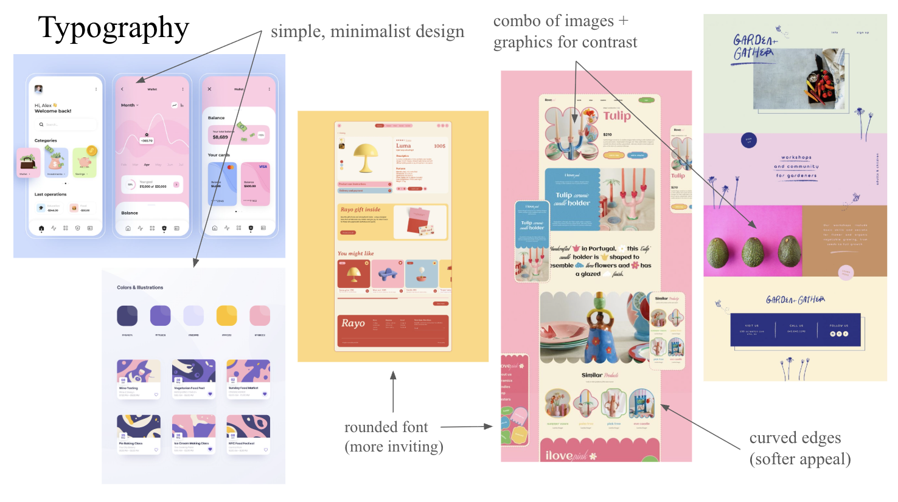
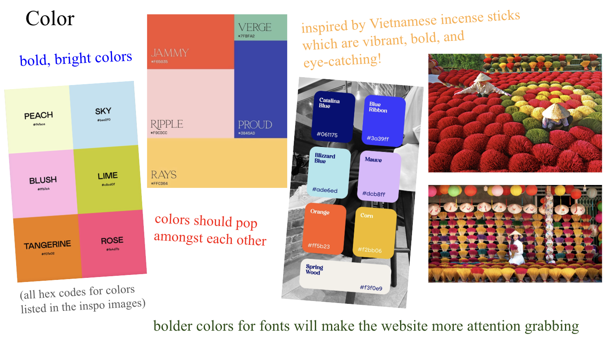

# 4B Final Submission Video (10/28/2025 + 3 slack) 

# 4B Final Visual Design Study (10/28/2025 + 3 slack) 
Link to full Visual Design Study slides [here](https://docs.google.com/presentation/d/1zV5XiA8NUZLHCoqC07dM17Uk87HDKyaAUvbePXb58yo/edit?usp=sharing) or view below. 


-----


# 4B Check In Submission Video (10/21/2025)

Video is attached [here](https://youtu.be/vbV8pMq50wI) with narration of my User Journey, which is also written below. 

# 4B Check In User Journey (10/21/2025)

Welcome to my prototype for my individual project, which is an application to monitor the progress of lines and help event-goers better predict wait times and increase transparency. 

This page is the dashboard, which every user is initially directed to. We are able to do a variety of actions from checking in to an organized event, asking for intelligent predictions, submitting a user report, to starting our own line. We begin with user Tom who is interested in joining the line for a restaurant event with id `restaurant-1` that does not have a virtual check in. He navigates to the Queues tab and sees that someone has already created the queue. If it was not created, he also has the option to create it himself with the Create Queue button.

When he arrives at the restaurant, he notices a short line at the restaurant and navigates to the User Report section to report his findings. He filters the reports to his desired event and notices that the most report for `restaurant-1` says that there are 3000 people in line and a 300 min wait. He does not feel that this is accurate so he does not validate that report, and provides his own update instead. He can do so by directly clicking update on the existing report or clicking submit report at the top right, which will lead him to the same pop up, but he will need to select the queue manually. From here, he updates with his information and submits the report. 

When we navigate back to the Queues section, this new information is immediately synced here too so all sections remain up to date. Lastly, he wants to see if AI can help him get a more accurate prediction it uses historical data to make statistical calculations, so he navigates to the predictions page to run a prediction for `restaurant-1` and is provided with another entry there containing the predicted time, confidence interval and predicted entry probability. 

# LineLens Frontend

A modern Vue.js frontend application for the LineLens queue management and prediction system.

## Features

- **Queue Management**: Create, view, and update queue statuses
- **AI Predictions**: Run predictions and get forecasts for wait times and entry probabilities
- **User Reports**: Submit and manage real-time queue reports
- **Virtual Check-in**: Reserve spots in queues remotely
- **Responsive Design**: Works on desktop and mobile devices
- **Real-time Updates**: Live data synchronization with the backend

## Tech Stack

- **Vue 3** - Progressive JavaScript framework
- **Vite** - Fast build tool and development server
- **Pinia** - State management
- **Vue Router** - Client-side routing
- **Tailwind CSS** - Utility-first CSS framework
- **Axios** - HTTP client for API requests
- **Lucide Vue Next** - Beautiful icons

## Getting Started

### Prerequisites

- Node.js (version 16 or higher)
- npm or yarn
- Backend server running on http://localhost:8000

### Installation

1. Install dependencies:
```bash
npm install
```

2. Start the development server:
```bash
npm run dev
```

3. Open your browser and navigate to `http://localhost:3000`

### Building for Production

```bash
npm run build
```

The built files will be in the `dist` directory.

## Project Structure

```
src/
├── components/          # Reusable Vue components
│   ├── ActivityItem.vue
│   ├── CreateQueueModal.vue
│   ├── FeatureCard.vue
│   ├── NavBar.vue
│   ├── PredictionCard.vue
│   ├── QueueCard.vue
│   ├── ReportCard.vue
│   ├── ReservationCard.vue
│   ├── ReserveSpotModal.vue
│   ├── RunPredictionModal.vue
│   ├── StatCard.vue
│   ├── SubmitReportModal.vue
│   ├── UpdateStatusModal.vue
│   ├── ViewReportModal.vue
│   ├── ViewReservationModal.vue
│   └── ViewStatusModal.vue
├── services/            # API service layer
│   └── api.js
├── stores/              # Pinia stores for state management
│   ├── checkinStore.js
│   ├── predictionStore.js
│   ├── queueStore.js
│   └── reportStore.js
├── views/               # Page components
│   ├── Dashboard.vue
│   ├── Predictions.vue
│   ├── QueueManagement.vue
│   ├── UserReports.vue
│   └── VirtualCheckIn.vue
├── router/              # Vue Router configuration
│   └── index.js
├── App.vue              # Root component
├── main.js              # Application entry point
└── style.css            # Global styles
```

## API Integration

The frontend communicates with the backend through the following API endpoints:

### QueueStatus
- `POST /api/QueueStatus/createQueue` - Create a new queue
- `POST /api/QueueStatus/updateStatus` - Update queue status
- `POST /api/QueueStatus/_viewStatus` - View queue status

### Prediction
- `POST /api/Prediction/runPrediction` - Run AI prediction
- `POST /api/Prediction/getForecast` - Get forecast
- `POST /api/Prediction/cleanOldReports` - Clean old reports

### UserReport
- `POST /api/UserReport/submitReport` - Submit user report
- `POST /api/UserReport/setReportValidationStatus` - Validate report
- `POST /api/UserReport/_getReport` - Get report details
- `POST /api/UserReport/_getValidatedReportsByQueue` - Get validated reports
- `POST /api/UserReport/_getAllReports` - Get all reports

### VirtualCheckIn
- `POST /api/VirtualCheckIn/reserveSpot` - Reserve spot
- `POST /api/VirtualCheckIn/cancelSpot` - Cancel reservation
- `POST /api/VirtualCheckIn/expireReservations` - Expire reservations
- `POST /api/VirtualCheckIn/_getReservationDetails` - Get reservation details
- `POST /api/VirtualCheckIn/_getUserActiveReservation` - Get user reservation

## State Management

The application uses Pinia for state management with the following stores:

- **queueStore**: Manages queue data and operations
- **predictionStore**: Handles prediction data and AI operations
- **reportStore**: Manages user reports and validation
- **checkinStore**: Handles virtual check-in reservations

## Styling

The application uses Tailwind CSS for styling with a custom design system:

- **Primary Colors**: Blue theme for main actions
- **Secondary Colors**: Gray theme for secondary elements
- **Status Colors**: Green (success), Red (error), Yellow (warning), Orange (info)
- **Responsive Design**: Mobile-first approach with breakpoints

## Development

### Available Scripts

- `npm run dev` - Start development server
- `npm run build` - Build for production
- `npm run preview` - Preview production build
- `npm run test` - Run tests
- `npm run test:ui` - Run tests with UI

### Code Style

- Use Vue 3 Composition API with `<script setup>`
- Follow Vue.js style guide
- Use TypeScript-style prop definitions
- Implement proper error handling
- Use semantic HTML elements

## Contributing

1. Fork the repository
2. Create a feature branch
3. Make your changes
4. Add tests if applicable
5. Submit a pull request

## License

This project is part of the LineLens system and follows the same license terms.
